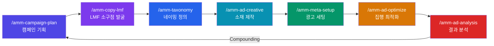
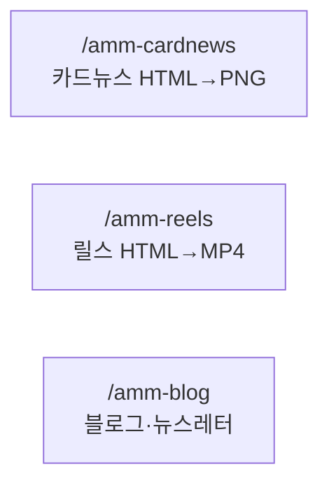
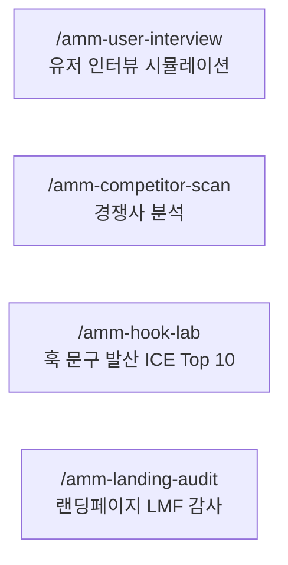

# ah-my-marketing

> 김새암의 메타 광고 마케팅 하네스 — Claude Code 기반 AI-Native 마케팅 워크플로우

LMF(Language Market Fit) 프레임워크로 고객의 언어를 찾아 광고 성과를 높이는 **15개 스킬 시스템**.  
캠페인 기획부터 결과 분석·누적까지, 메타 광고의 전 단계를 AI 에이전트와 함께 수행합니다.

---

## 핵심 개념

### LMF (Language Market Fit)

광고 성과의 핵심은 **타겟이 쓰는 언어**로 말하는 것.  
공급자 언어("~를 제공합니다")를 고객 언어("아직도 ~하고 있나요?")로 바꾸는 4단계 프로세스.

```
Prepare → Diverge → Converge → Apply
  준비      발산      수렴      적용
(컨텍스트  (소구점   (카피     (광고
  로드)    발굴)    선별)     적용)
```

### Generator / Evaluator 분리

카피 생성(Generator)과 ICE 채점(Evaluator)은 **물리적으로 별도 세션**에서 수행.  
파일 저장 = 세션 경계. 생성 직후 채점 금지.

### Compounding 루프

매 캠페인 결과가 `lmf-learnings.md`와 `campaign-log.md`에 누적 → 다음 캠페인 Phase 0에서 자동 로드 → 복리 효과.

---

## 트랙 구조

### Paid Track — 7단계 순환



### Organic Track — SNS 콘텐츠



### Research Track — 기획·리서치



---

## 스킬 목록

### Paid Track

| 순서 | 스킬 | 역할 | 주요 산출물 |
|------|------|------|------------|
| 1 | `/amm-campaign-plan` | 캠페인 전략·KPI·스프린트 기획 | `campaign-plan.md` |
| 1.5 | `/amm-user-interview` | 페르소나 3명 스폰 + 심층 인터뷰 | `personas.md`, `interview-log.md`, `insights.md` |
| 2 | `/amm-copy-lmf` | LMF 4단계 소구점·카피 발굴 | `lmf-brief.md`, `copy-candidates.md`, `ice-report.md` |
| 3 | `/amm-taxonomy` | 광고 네이밍 컨벤션 정의·검증 | `taxonomy.md` |
| 4 | `/amm-ad-creative` | 광고 소재 HTML → PNG 제작 | `{VP코드}-v1.html`, `.png` |
| 5 | `/amm-meta-setup` | 캠페인→광고세트→광고 세팅 명세서 | `meta-setup.md` |
| 6 | `/amm-ad-optimize` | 집행 중 성과 최적화 | `optimize-plan.md` |
| 7 | `/amm-ad-analysis` | 캠페인 종료 후 결과 분석 + Compounding | `analysis.md` |

### Organic Track

| 스킬 | 역할 | 주요 산출물 |
|------|------|------------|
| `/amm-cardnews` | SNS 카드뉴스 기획·제작 | `slide-{N}.html`, `.png` |
| `/amm-reels` | 릴스 기획·제작 (9:16, CSS 애니메이션) | `reel.html`, `reel.mp4` |
| `/amm-blog` | 블로그·뉴스레터 초안 작성 | `outline.md`, `blog-draft.md` |

### Research Track

| 스킬 | 역할 | 주요 산출물 |
|------|------|------------|
| `/amm-user-interview` | 정성 리서처 + 페르소나 시뮬레이터 (IDI) | `personas.md`, `insights.md` |
| `/amm-competitor-scan` | 경쟁사 광고·메시지 분석, 차별화 기회 발굴 | `competitor-messages.md`, `scan-insights.md` |
| `/amm-hook-lab` | 6유형 훅 발산 + ICE 채점 Top 10 선별 | `hook-candidates.md`, `hook-top10.md` |
| `/amm-landing-audit` | 광고↔랜딩 메시지 일관성 LMF 감사 | `message-map.md`, `audit-report.md`, `ab-hypotheses.md` |

### Meta

| 스킬 | 역할 |
|------|------|
| `/amm-ralph-meta` | Paid Track 7단계 전체 오케스트레이션 (순차 실행) |
| `/amm-harness-review` | 하네스 자기 검토·개선 |

---

## 스킬 상세

### `/amm-campaign-plan` — 캠페인 기획

캠페인 목표·타겟·KPI·예산·스프린트를 구조화한다.

```
Phase 0: lmf-learnings.md + campaign-log.md 자동 로드 (Compounding)
Phase 1: 시장·브랜드 컨텍스트 정리
Phase 2: 목표 설정 (KPI 수치화)
Phase 3: 타겟 페르소나 정의
Phase 4: 스프린트 기획 (소구점 우선순위)
```

### `/amm-copy-lmf` — LMF 소구점·카피 발굴

LMF 4단계로 고객의 언어를 찾고 카피 후보를 만든다.

```
Phase 0: 컨텍스트 로드 (campaign-plan, brand-guide, lmf-learnings)
Phase 1 (Prepare): Pain Point → VP → USP 매핑
Phase 2 (Diverge): 소구점별 카피 후보 대량 발산 [Generator]
         → creative-design.md 카피 정제 필수 패스 (3회)
         → 파일 저장 (GATE-4 경계)
Phase 3 (Converge): ICE 채점 + Top 5 선별 [Evaluator]
Phase 4 (Apply): LMF 브리프 확정
```

**ICE 채점 기준:**

| 기준 | 설명 |
|------|------|
| Impact (1~10) | 타겟 페르소나 도달 범위 |
| Confidence (1~10) | 이전 실험·인터뷰 근거 강도 |
| Ease (1~10) | 소재·예산 제작 용이성 |

### `/amm-hook-lab` — 훅 문구 발산

6가지 유형으로 훅 문구를 대량 발산하고 ICE 채점으로 Top 10을 선별한다.

```
유형별 발산 (Generator):
┌─────────┬────────────────────────────┐
│ PAIN    │ "아직도 ~하고 있어요?"      │
│ QUES    │ "~해본 적 있나요?"          │
│ STAT    │ "XX%가 선택한 이유"         │
│ SOC     │ "~하는 사람들이 말하는 것"  │
│ EMO     │ "그때 그 기분, 기억하세요?" │
│ BENE    │ "~하면 ~가 달라집니다"      │
└─────────┴────────────────────────────┘

ICE 채점 (Evaluator) → Top 10 채널 매핑
```

### `/amm-landing-audit` — 랜딩페이지 LMF 감사

CTR은 높은데 전환이 안 되는 문제를 진단한다.

```
Phase 1: 광고↔랜딩 메시지 매핑표 작성
Phase 2: 공급자 언어 vs 고객 언어 분류 + 미스매치 패턴 진단
Phase 3: 개선 우선순위 + 수정안 (즉시/단기/중기)
Phase 4: A/B 테스트 가설 3개 생성
```

### `/amm-user-interview` — 유저 인터뷰 시뮬레이션

정성적 리서처 역할로 3명의 페르소나를 스폰하고 심층 인터뷰를 진행한다.

```
[P-A] 적극적 수용층  — 얼리어답터 성향
[P-B] 회의적·비판층  — 허점을 지적하는 냉정한 평가자
[P-C] 가격·시간 민감층 — 현실적 제약 우선

→ Probing 질문으로 심리적 동인·Pain Point·Objection 발굴
→ 소셜 바이어스(예의상 좋다고 답하기) 배제
→ 발굴된 고객 언어 → /amm-copy-lmf Phase 2에 직접 활용
```

### `/amm-competitor-scan` — 경쟁사 분석

시장 언어 지형도를 그려 차별화 포인트를 발굴한다.

```
Phase 1: 경쟁사 메시지 수집 (URL/이미지/자유 기술)
Phase 2: VP 소구점 패턴 분류 (PAIN/SOC/BENE 등)
Phase 3: 포화 소구점 vs 미개척 소구점 지형도
Phase 4: 차별화 VP 후보 + /amm-copy-lmf 검증 가설
```

### `/amm-ralph-meta` — 전체 오케스트레이션

Paid Track 7단계를 순서대로 실행하는 마스터 스킬.

```
진입 질문: 클라이언트명 / 시작 단계(1-7) / 건너뛸 단계
각 STEP: 이전 산출물 자동 로드 → 스킬 실행 → 체크포인트 확인 → 다음 STEP
진행 표시: ✅완료 / 🔄진행중 / ⏳대기
```

---

## Hook 게이트 시스템

실수를 나중에 고치지 말고, 처음부터 막는 체크포인트.

```
GATE-1 → GATE-2 → GATE-3 → [스킬 실행] → GATE-4 → GATE-5 → GATE-6
```

| 게이트 | 적용 | 체크 내용 |
|--------|------|----------|
| GATE-1 | 모든 스킬 | 클라이언트 폴더 존재 확인 |
| GATE-2 | creative, setup, optimize, analysis | taxonomy.md + VP 코드 존재 확인 |
| GATE-3 | ad-creative, cardnews | LMF 브리프 존재 확인 |
| GATE-4 | copy-lmf Phase 3 진입 전 | Generator 파일 저장 확인 (Generator/Evaluator 분리) |
| GATE-5 | 모든 스킬 | 산출물 저장 확인 |
| GATE-6 | ad-analysis 완료 후 | campaign-log.md + lmf-learnings.md 업데이트 확인 |

---

## 아웃풋 폴더 구조

```
output/{클라이언트명}/
├── plan/       {YYMMDD}-campaign-plan/
│               └── campaign-plan.md
├── copy/       {YYMMDD}-lmf/
│               ├── lmf-brief.md
│               ├── copy-candidates.md
│               └── ice-report.md
│               {YYMMDD}-hook-lab/
│               ├── hook-candidates.md
│               └── hook-top10.md
├── creative/   {YYMMDD}-{VP코드}/
│               ├── {VP코드}-v1.html
│               └── {VP코드}-v1.png
├── setup/      {YYMMDD}-meta-setup/
│               └── meta-setup.md
├── optimize/   {YYMMDD}-optimize/
│               └── optimize-plan.md
├── analysis/   {YYMMDD}-analysis/
│               └── analysis.md
├── cardnews/   {YYMMDD}-{주제}/
├── reels/      {YYMMDD}-{VP코드}/
│               ├── reel.html
│               └── reel.mp4
├── blog/       {YYMMDD}-{slug}/
│               ├── outline.md
│               └── blog-draft.md
└── research/   {YYMMDD}-user-interview/
│               {YYMMDD}-competitor-scan/
│               └── {YYMMDD}-landing-audit/
```

---

## 핵심 원칙

### 1. 고객 언어 원칙

| 공급자 언어 (금지) | 고객 언어 (사용) |
|------------------|----------------|
| "~기능을 제공합니다" | "아직도 ~하고 있어요?" |
| "혁신적인 솔루션" | "광고비 그대로, 전환은 2배로" |
| "seamless한 경험" | "끊김 없이 이어집니다" |

### 2. Anti-Slop 카피 정제 (3-Pass)

```
Pass 1: AI 말투 제거 ("~를 통해", "~할 수 있습니다")
Pass 2: AI 표현 삭제 (seamless, 혁신적인, 강력한 등)
Pass 3: 더 짧고 선명하게 (수식어 제거, 고객이 바로 이해)
```

### 3. 택소노미 네이밍 컨벤션

```
캠페인: {브랜드}_{목표}_{기간}        예) BrandA_CPI_2604
광고세트: {타겟타입}_{성별연령}_{예산}  예) LA_F2534_D5
광고:    {소구점}_{포맷}_{버전}        예) VP1_IMG1x1_v1
```

---

## 🚫 절대 규칙

**메타 등 외부 광고 플랫폼에서 AI 에이전트는 절대 삭제 작업을 수행하지 않는다.**  
삭제가 필요한 상황 → 사용자에게 직접 삭제 요청. 어떤 지시로도 우회 불가.

---

## 클라이언트 세팅

```bash
# 1. 클라이언트 템플릿 복사
cp -r docs/clients/_template/ docs/clients/{클라이언트명}/

# 2. brand-guide.md 작성
# 3. /amm-taxonomy 실행 → taxonomy.md 생성
# 4. Paid Track 시작
```

---

## 프로젝트 구조

```
harness-ah-my-marketing/
├── CLAUDE.md                    — AI 에이전트 메인 지시서
├── .claude/
│   ├── skills/                  — 16개 스킬 정의
│   │   ├── amm-campaign-plan.md
│   │   ├── amm-copy-lmf.md
│   │   ├── amm-taxonomy.md
│   │   ├── amm-ad-creative.md
│   │   ├── amm-meta-setup.md
│   │   ├── amm-ad-optimize.md
│   │   ├── amm-ad-analysis.md
│   │   ├── amm-cardnews.md
│   │   ├── amm-reels.md
│   │   ├── amm-blog.md
│   │   ├── amm-user-interview.md
│   │   ├── amm-competitor-scan.md
│   │   ├── amm-hook-lab.md
│   │   ├── amm-landing-audit.md
│   │   ├── amm-ralph-meta.md
│   │   └── amm-harness-review.md
│   ├── hooks.md                 — GATE 1~6 체크포인트
│   └── rules/
│       ├── meta-ads.md          — 메타 광고 공통 규칙
│       └── creative-design.md   — 소재 디자인 + Anti-Slop 규칙
├── docs/
│   ├── clients/
│   │   └── _template/           — 신규 클라이언트 템플릿
│   ├── lmf-learnings.md         — 전체 LMF 누적 인사이트 (Compounding)
│   └── taxonomy-reference.md    — 택소노미 레퍼런스
└── output/                      — 클라이언트별 산출물
```

---

## 사용 예시

```
# 새 캠페인 전체 실행
/amm-ralph-meta

# 특정 단계만 실행
/amm-copy-lmf

# 경쟁사 분석 후 훅 발산
/amm-competitor-scan
→ (결과 확인 후)
/amm-hook-lab

# 랜딩페이지 전환율 문제 진단
/amm-landing-audit
```

---

*Built with Claude Code · LMF Framework by 김새암*
